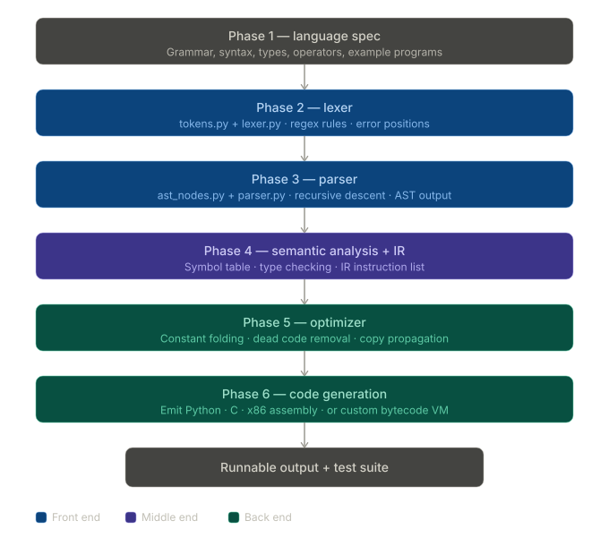

# Architecture


- **Front end** (blue) — handles your source text. **The lexer** scans characters and produces tokens (keywords, identifiers, numbers, operators). The **parser** takes those tokens and builds an **AST** (abstract syntax tree) by applying your grammar rules.

- **Middle end** (purple) — works on meaning and structure. **Semantic analysis** checks types, resolves variable scopes, and builds a symbol table. **IR generation** converts the AST into a platform-neutral intermediate form (like three-address code or SSA).

- **Back end** (teal) — targets the machine. The **optimizer** applies passes like constant folding and dead code elimination. The **code generator** emits the final output — Python bytecode, x86 assembly, or whatever target you choose.

The dashed arrow on the left represents the error/diagnostic path — parse errors, type mismatches, and so on flow back up to be reported to the user.

For a Python implementation, a typical stack would be:
- Lexer → use `re` or write a manual scanner
- Parser → recursive descent by hand, or use `lark` or `PLY`
- AST → Python dataclasses or `ast.AST` subclasses
- IR → a simple list of instruction objects
- Code gen → emit Python, C, or use `llvmlite` for LLVM IR

# Project requirements
## Language design (define this first)
Before writing a single line of Python, you need to decide what your language looks like. This means defining your syntax — what keywords it will have, how blocks are delimited (indentation like Python, braces like C, or end keywords), how types work (static or dynamic), what data types you support (integers, floats, strings, booleans, lists, etc.), whether you support functions and recursion, and what operators are available. Write a grammar spec or at least a dozen example programs in your language before touching any compiler code.

## Python version & dependencies
You need Python 3.10 or higher (for structural pattern matching, which makes AST walking much cleaner). Your core compiler should have zero third-party dependencies if you want to learn properly. Optionally you can use lark or PLY for the parser, but writing a recursive descent parser by hand is far more educational.

## File structure
```
basic_plus_plus/
  compiler/
    lexer.py        ← tokenizer
    tokens.py       ← token type definitions
    parser.py       ← builds AST from tokens
    ast_nodes.py    ← dataclasses for every AST node
    semantic.py     ← type checker + symbol table
    ir.py           ← intermediate representation
    optimizer.py    ← IR optimization passes
    codegen.py      ← emits target output
  runtime/
    builtins.py     ← print, len, range, etc.
  tests/
    test_lexer.py
    test_parser.py
    test_semantic.py
  examples/         ← example programs in your language
  main.py           ← CLI entry point
```


## Build phases


- **Phase 1 — language spec**. Write your grammar in BNF or EBNF notation. Decide on 10–20 core constructs: variable assignment, if/else, loops, functions, return, print. Write 5–10 sample programs. This document is your source of truth for everything that follows.

- **Phase 2 — lexer**. Define a `TokenType` enum covering all your keywords, operators, delimiters, and literals. The lexer reads a string character by character, matches patterns (keywords before identifiers, so `if` isn't misread as a variable name), and emits a flat list of `Token(type, value, line, col)` objects. Track line and column numbers from the start — debugging errors without them is painful.

- **Phase 3 — parser**. This is the biggest phase. Write one parsing function per grammar rule. Each function consumes tokens from the list and returns an AST node (a Python dataclass). For example, **parse_if()** calls **parse_expr()** for the condition, then **parse_block()** for the body. The parser should raise clear **ParseError** exceptions with the offending line number.

- **Phase 4 — semantic analysis + IR**. Walk the AST with a visitor pattern. Maintain a `SymbolTable` (a stack of dicts, one per scope) to track variable declarations and types. After the tree is clean, do a second pass to emit a linear list of three-address IR instructions like `t0 = a + b` or if `t0 goto L1`. This IR is much easier to optimize than the tree.

- **Phase 5 — optimizer**. Write passes that transform the IR list. Constant folding (`t0 = 2 + 3` → `t0 = 5`) and dead code elimination (remove instructions whose result is never read) are good starting points. Each pass is a function that takes an IR list and returns a new IR list.

- **Phase 6 — code generation**. Walk the optimized IR and emit your target. The easiest target is Python source code (transpilation), which lets you run your programs immediately. A custom stack-based bytecode VM is the next step up, and is a great learning project in itself.

# Build order recommendation
Build strictly in this order and test each phase in isolation before moving on. Don't touch the optimizer until your parser produces correct ASTs for every test case. The most common mistake is trying to build all six phases at once — you end up with bugs in every layer and no way to isolate them.